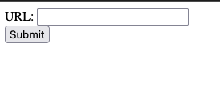

# Web Text Scraper

## Overview
A simple yet powerful web text scraping application built with Flask that allows you to extract textual content from any website. This tool fetches the raw text from a given URL, strips away HTML formatting, and presents the content in a clean, readable format.

## Features
- **Simple URL Input**: Enter any website URL to scrape its text content
- **Clean Text Extraction**: Removes HTML markup and extracts plain text
- **Copy to Clipboard**: One-click copying of scraped content
- **Responsive Design**: Works on desktop and mobile devices
- **In-memory Caching**: Temporarily stores scraped content for quick retrieval

## Tech Stack
- **Backend**: Python 3.10 with Flask web framework
- **Web Scraping**: BeautifulSoup4 and Requests libraries
- **Frontend**: Basic HTML with inline JavaScript for clipboard functionality

## Installation

### Prerequisites
- Python 3.10+
- Poetry (dependency manager)

### Setup
1. Fork this template on Replit
2. The dependencies will be automatically installed when you run the project
3. Click the Run button to start the server

### Dependencies
This project uses the following Python packages:
- Flask: Web framework
- Requests: HTTP library for sending requests
- BeautifulSoup4: HTML parsing library
- BS4: BeautifulSoup wrapper

## Usage

1. Run the application by clicking the Run button in Replit
2. Access the web interface at the URL shown in the console (typically at port 8080)
3. Enter a website URL in the input field and click "Submit"
4. View the extracted text content
5. Use the "Copy to Clipboard" button to copy the text for your needs
6. Click "Back to form" to scrape another URL

## How It Works

1. The application receives a URL from the user via a form submission
2. It makes an HTTP request to the provided URL using the Requests library
3. The HTML response is parsed using BeautifulSoup
4. All text content is extracted from the HTML document
5. A unique ID is generated for this scraped content
6. The text is stored in an in-memory cache
7. The user is redirected to a page displaying the extracted text

## Security Considerations

- The application uses a random secret key for Flask sessions
- The in-memory cache is temporary and doesn't persist between application restarts
- No personal data is stored or shared

## Limitations

- The scraper extracts all text from a webpage, which may include navigation menus, footers, etc.
- Some websites may block scraping attempts
- JavaScript-rendered content may not be captured
- Very large websites may cause memory issues due to in-memory caching

## Troubleshooting

- **URL Error**: Ensure the URL includes the protocol (http:// or https://)
- **Access Denied**: Some websites employ anti-scraping measures; try a different site
- **Timeout**: Large websites might take longer to scrape; be patient

## Future Enhancements

- Add text filtering options
- Implement persistent storage
- Add support for JavaScript-rendered content
- Create options for formatting the extracted text
- Add extraction of specific elements (e.g., only paragraphs, headings)

## License
This project is available as an open-source template on Replit. Feel free to fork, modify, and use it according to your needs.

## Acknowledgments
- This project uses [Flask](https://flask.palletsprojects.com/) for the web framework
- Text extraction is powered by [BeautifulSoup](https://www.crummy.com/software/BeautifulSoup/bs4/doc/)
- HTTP requests are handled by the [Requests](https://requests.readthedocs.io/) library
